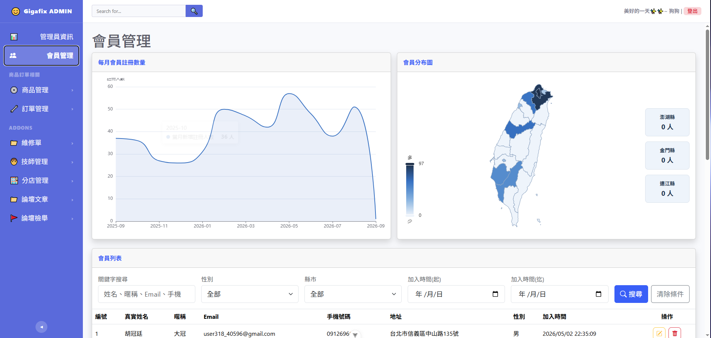
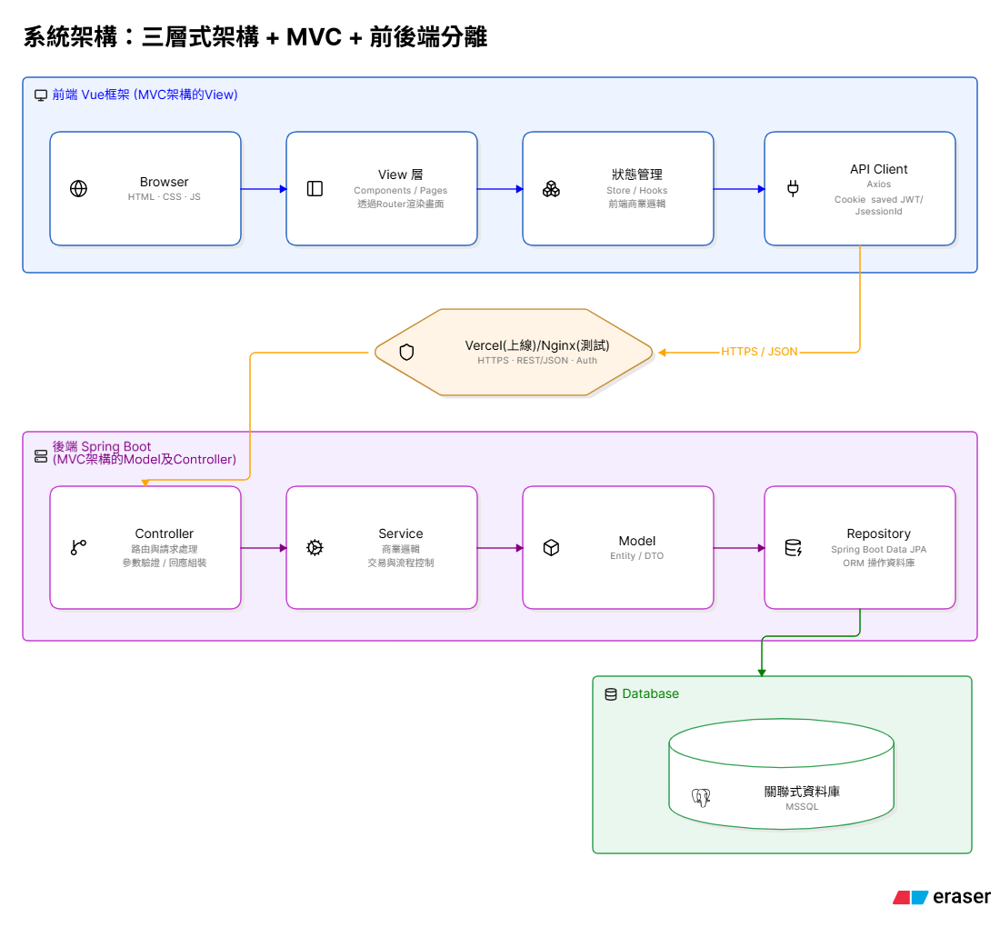
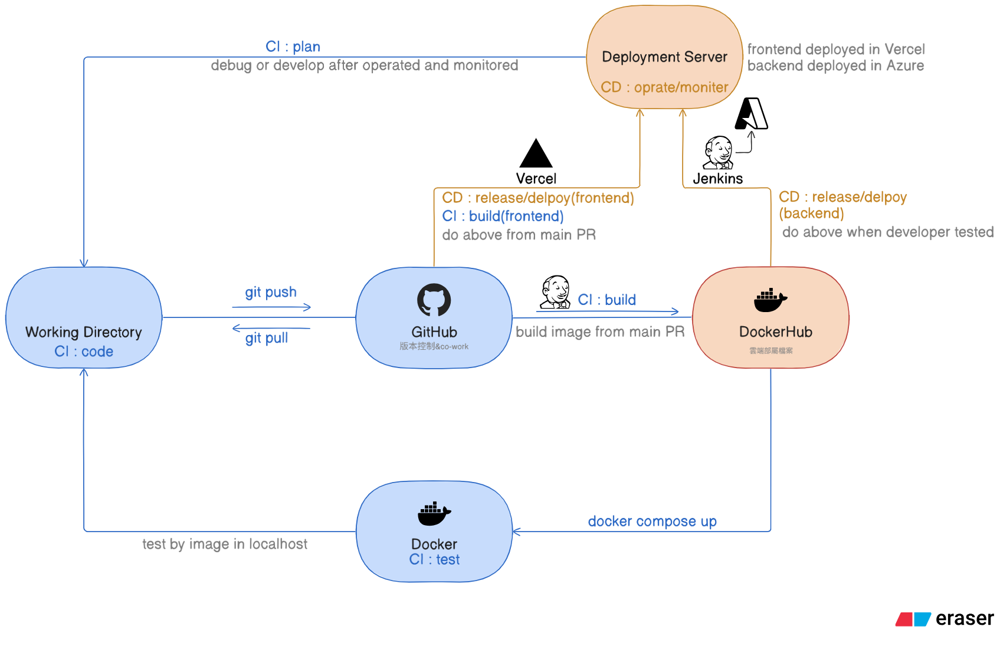

# Gigafix

> 本專案僅供「Ispn資轉國際 ─ AI輔助學習-跨域Java軟體工程師就業養成班」期末發表使用
> 不用於商業用途，如有侵權敬請告知

Gigafix 機不可失 ─ 是一個以中小型二手手機行業者為目標客群，提供網頁式RMS(Retail Management System, 零售管理系統)專案

本專案採訪了相關業者了解使用者需求，發現中小型二手手機行會仰賴各自的小型庫存管理系統作為核心營運工具，因二手手機行是透過管理收及賣出價以獲得其商業獲利空間
本團隊汰換二手手機行內部系統升級為網頁式RMS，使其功能性不在單只有庫存管理，而是更加貼近業者商業行為需求

🔗 **前台網站（正式環境）**：https://gigafix.vercel.app/

> 網站目前只有前端開啟，只有正式Demo才會開啟後端雲端部屬的容器

Gigafix 拆分為五大系統，每個系統都有對應的前台（顧客使用）與後台（店家管理）介面：

| 系統                        | 對應 RMS 功能    | 前台（顧客）           | 後台（店家）                                             |
| --------------------------- | ---------------- | ---------------------- | -------------------------------------------------------- |
| **會員系統**<br>member      | CRM 顧客關係管理 | 註冊/登入/會員中心     | 會員列表查詢、篩選、編輯、刪除，會員成長曲線與地區分布圖 |
| **商品系統**<br>product     | 商品/庫存管理    | 商品瀏覽、篩選、搜尋   | 商品新增/編輯/刪除、進階篩選、JSON 匯入匯出              |
| **訂單系統**<br>cart, order | 銷售/收銀管理    | 加入購物車、結帳       | 訂單建立、出貨、狀態管理                                 |
| **維修系統**<br>repair      | 售後服務管理     | 線上預約維修           | 維修單狀態管理、分店管理、技師管理                       |
| **討論區系統**<br>forum     | 社群/行銷經營    | 發文、留言、按讚、收藏 | 文章/分類管理、檢舉處理                                  |

## 網站前後台畫面

### 前台首頁


### 後台：會員管理



## 系統架構

Gigafix 是前後端分離的三層式架構：前端 SPA 透過 REST API 呼叫後端，後端處理商業邏輯後經 JDBC 存取資料庫。



### 前端

以 SPA 呈現前台（顧客）與後台（店家管理）兩套介面，透過 RESTful API 與後端溝通，畫面路由藉由 Vue Router 管理

### Web Server

由 Nginx 提供前端打包後的靜態頁面，並把 `/api/*` 的請求反向代理到後端，讓瀏覽器端只需面對單一 origin (避免CORS)

### 後端

提供 RESTful API，依模組（會員、商品、訂單、維修、討論區）處理商業邏輯，並以 JWT/session 做身份驗證/授權

### 資料庫

儲存會員、商品、訂單、維修、討論區等所有業務資料，Schema 由 Hibernate（JPA）依 Entity 自動建立/更新

## 使用技術

- **前端**：Vue 3.5、Vite 8、Pinia、Vue Router、Bootstrap 5
- **後端**：Java 21、Spring Boot 4.1、Spring Data JPA、Spring Security、JWT
- **資料庫**：Microsoft SQL Server 2022（本機開發用 Docker 容器）、Azure SQL Database（正式環境，使用微軟的Azure租SQL服務）
- **Web Server**：Nginx（僅本機 Docker Compose 環境使用，提供前端靜態頁面並反向代理 `/api/*` 到後端；正式環境前端改由 Vercel 直接服務，不會用到這個 Nginx image）
- **CI/CD**：Jenkins（後端 build image、push 到 DockerHub，人工確認後部署到 Azure）、Vercel（前端 GitHub 自動 build/deploy）
- **容器化**：Docker、Docker Compose、DockerHub（image 倉庫）
- **雲端部署**：Vercel（前端 Hosting）、Azure Container Apps（後端）、Azure SQL Database（資料庫）
- **其他API串接**：reCAPTCHA、Google Client(後端)/Google-login(前端)、jjwt、echarts、bootstrap/bootstrap-icon、taiwan-atlas
- **版本控制**：Git、GitHub

## 系統需求

依據想怎麼「看到」這個專案，分三種情況：

- **直接連正式網站（免安裝）**：打開瀏覽器連 https://gigafix.vercel.app/ 就好，不需要裝任何東西(後端跟資料庫已經部屬，但正式Demo才會啟動及聯動)
- **用 Docker 跑本機環境（推薦）**：Docker、Docker Compose
- **不用 Docker、本機分開跑前後端**：JDK 21、Maven（或用專案內的 `mvnw`）、Node.js（版本需求見 `gigafix-frontend/package.json` 的 `engines`）

## 本機啟動方式（Docker Compose）

專案根目錄有兩份 docker compose 設定，用途不一樣：

- **`docker-compose.yml`**：把 `gigafix-backend`、`gigafix-frontend` 的原始碼各自本機 build 成 image 再跑起來，適合改完程式碼想測試現在這份 code，但須於根目錄設定`.env`檔案設定環境變數
- **`docker-compose.images.yml`**：不 build，直接拉 Jenkins 已經 push 到 DockerHub 的現成 image 來跑，適合想確認「已經推上 DockerHub、準備要上 Azure 的那個版本」對不對，用法見檔案開頭註解

以下以 `docker-compose.yml`（本機 build）為例：

1. 在專案根目錄建立 `.env`，填入以下變數：
   - `MSSQL_SA_PASSWORD`：資料庫 sa 密碼
   - `JWT_SECRET`：後端簽發 JWT 用的密鑰
   - `GIGAFIX_GMAIL_USERNAME` / `GIGAFIX_GMAIL_PASSWORD`：寄送 Email（OTP、忘記密碼等）用的 Gmail 帳密
   - `RECAPTCHA_SECRET_KEY`：註冊會員時人機驗證用的secret key，去 [reCAPTCHA後台](https://www.google.com/recaptcha/admin) 申請
2. 啟動所有服務：
   ```bash
   docker compose up -d --build
   ```
3. 開啟瀏覽器：
   - 前台網站：http://localhost
   - 後端 API：http://localhost:8080

## 本機啟動方式（不用 Docker，前後端分開跑）

適合想直接進 IDE debug、不想每次改程式都重新 build image 的情境。

1. **啟動資料庫**：可以只用 `docker compose up -d db db-init`，讓 MSSQL 跑在容器裡，前後端則在本機直接執行
2. **啟動後端**：
   ```bash
   cd gigafix-backend
   ./mvnw spring-boot:run
   ```
   需要設定跟 `docker-compose.yml` 裡 `backend` 服務同樣的環境變數（`SPRING_DATASOURCE_URL`、`SPRING_DATASOURCE_USERNAME`、`SPRING_DATASOURCE_PASSWORD`、`JWT_SECRET`、`GIGAFIX_GMAIL_USERNAME`、`GIGAFIX_GMAIL_PASSWORD`、`RECAPTCHA_SECRET_KEY`），只是連線的 host 要改成 `localhost`（不是容器內的服務名稱 `db`）；因為這裡是直接用IDE/終端機跑，不是透過docker-compose帶入 `.env`，所以要自行在電腦上設定這些環境變數
3. **啟動前端**：
   ```bash
   cd gigafix-frontend
   npm install
   npm run dev
   ```
   `vite.config.js` 已經設定好把 `/api` 開發階段代理到 `http://localhost:8080`，不用另外設定 CORS

## 專案結構

```
gigafix/
├── gigafix-backend/          # Spring Boot 後端（依模組分package：member、product、cart、order、repair、forum、admin...）
├── gigafix-frontend/         # Vue 3 前端（依 features 分模組，各自有 view/component/router/store）
├── db-init/                  # 資料庫初始化用的 SQL
├── .env                      # 環境變數，git 沒有追蹤這個檔案，需依照「本機啟動方式」章節自行建立
├── docker-compose.yml        # 本機用 docker compose（自行 build image）
├── docker-compose.images.yml # 本機用 docker compose（直接拉 DockerHub 現成 image，不 build）
└── Jenkinsfile               # CI/CD pipeline
```

## CI/CD

整個 CI/CD 不是全部交給 Jenkins 一個人做，是照 DevOps 常見的「Plan → Code → Build → Test → Release → Deploy → Operate → Monitor」無限迴圈，分散在 Jenkins、人工、Azure/Vercel 三邊：

| 階段        | 執行者                             | 說明                                                                                                                                                         |
| ----------- | ---------------------------------- | ------------------------------------------------------------------------------------------------------------------------------------------------------------ |
| **Plan**    | 開發人員                           | 開發規劃，不在自動化流程裡                                                                                                                                   |
| **Code**    | 開發人員（本機 Working Directory） | 寫程式、`git push` 上 GitHub                                                                                                                                 |
| **Build**   | Jenkins                            | build backend、frontend 兩個 Docker image                                                                                                                    |
| **Release** | Jenkins                            | 把 build 好的 image push 到 DockerHub                                                                                                                        |
| **Test**    | 開發人員（手動）                   | Jenkins push 完 image 後，pipeline 會暫停在 Confirm 關卡；這段期間開發人員手動用 `docker-compose.images.yml` 把剛 push 上去的 image 拉下來，在本機跑起來測試 |
| **Deploy**  | Jenkins（開發人員確認通過後）      | 確認 image 沒問題、按下確認，Jenkins 才用 `az containerapp update` 把後端部署到 Azure Container Apps；前端則是 Vercel 自己接 GitHub 做，不經過 Jenkins       |
| **Operate** | Azure / Vercel                     | 服務實際跑在 Azure Container Apps（後端）+ Azure SQL Database（資料庫）、Vercel（前端）                                                                      |
| **Monitor** | 開發人員（手動）                   | 去 Azure Portal 看 Container App 的 log / Log Analytics，有異常再回頭處理，目前沒有自動告警                                                                  |

前端與後端走的是兩條不同的路：

- **前端**：Vercel 直接連 GitHub repo，push 到指定分支後由 Vercel 自己完成 build + deploy，不經過 Jenkins
- **後端**：`Jenkinsfile` 負責 build image、push 到 DockerHub，並在人工確認（測試）後部署到 Azure Container Apps

`Jenkinsfile` 定義了以下 stage：

### Build → Release

1. **Checkout**：從 Git 抓取最新程式碼
2. **Build backend image**：在 `gigafix-backend` 目錄用 Dockerfile build 後端 image
3. **Build frontend image**：在 `gigafix-frontend` 目錄用 Dockerfile build 前端 image（僅供本機 `docker-compose.images.yml` 測試用，正式環境的前端由 Vercel 另外從原始碼 build，不會用到這個 image）
4. **Push images**：把後端、前端兩個 image 推到 DockerHub

> 這幾個 stage 目前沒有自動化測試（後端只有一個空的 Spring Boot context load 測試、前端沒有測試），實際的 Test 階段是人工的，見上表

### Confirm → Deploy

5. **Confirm deploy to Azure**（僅 `main` 分支）：暫停 pipeline，等人工確認要部署的 image 沒問題才繼續，避免 main 上剛合併、還沒手動驗證過的版本被自動推上正式環境
6. **Deploy backend to Azure**（僅 `main` 分支）：確認後用 `az containerapp update` 把新 image 部署到 Azure Container Apps



## 網站部署

- **前端**：Vercel（由 GitHub repo 自動 build/deploy），`vercel.json` 把 `/api/*` 反向代理到後端的 Azure Container Apps URL
- **後端**：Azure Container Apps，image 來自 DockerHub，由 Jenkins 在人工確認後部署
- **資料庫**：Azure SQL Database（PaaS 代管服務）

## 目前已知限制

- **無多租戶(multi-tenant)設計**：目前一套系統對應一間店的資料，如果要賣給多間手機行，現階段做法是各自獨立部署一套（各自的資料庫、網域），還不是共用一套服務、資料互相隔離的 SaaS 架構
- **無 API 文件**：目前沒有整合 Swagger/OpenAPI，API 規格需直接看各模組的 Controller
- **測試覆蓋率低**：後端目前只有一個空的 Spring Boot context load 測試，前端沒有自動化測試，之後可以視情況補上單元測試/整合測試
